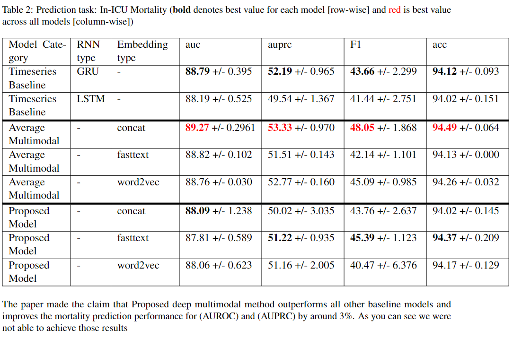
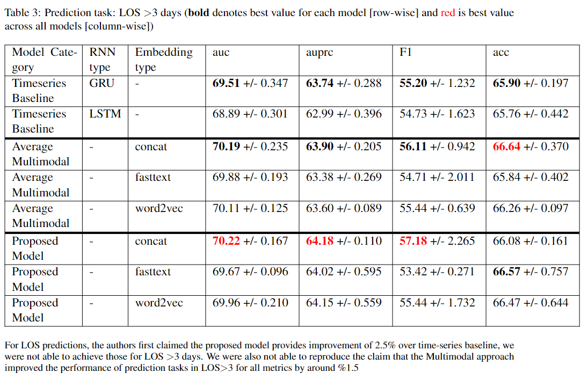
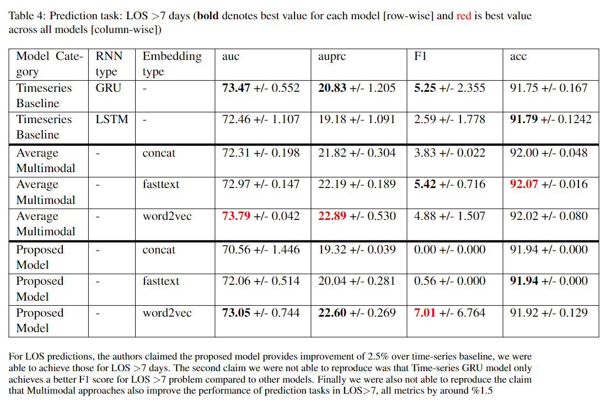

# Implementation for [Improving Clinical Outcome Predictions Using Convolution over Medical Entities with Multimodal Learning](#refereneces)

## <a name="prereq"></a> Prerequisites

### Environment Setup
1. Setup your conda virtual environment with the following environment information:

    Use `environments.yaml` to generate the dependencies for the conda environment (jupyter notebooks, tensorflow, spacy, gensim...)

    Run the below

    `conda env create --name your_env_name_here --file=environments.yaml` </br>
    `conda activate your_env_name_here`

1. If you are having issues installing any of the packages via the conda command above use the directory `package-installer-helpers` to aid in installing:
    * _install-all.sh_ used to install dependencies manually without the `environments.yaml` file
        * This file encompasses all of the commands from the below files
    * _install-biobert-embedding.sh_ used to install biobert embedding model dependency
    * _install-glove.sh_ used to install the glove dependency
    * _install-pip-dependencies.sh_ used to install all other pip dependencies

### Data downloads
1. Install the Med-7 data </br>
`wget https://www.dropbox.com/s/xbgsy6tyctvrqz3/en_core_med7_lg.tar.gz?dl=1` </br>
`pip install /path/to/downloaded/spacy2_model` </br>

1. Install the pertinent Mimic-III data </br>
`wget https://console.cloud.google.com/storage/browser/mimic_extract;tab=objects?prefix=&forceOnObjectsSortingFiltering=false?` </br>

1. Install the pre-trained fasttext model </br>
`wget https://drive.google.com/drive/folders/1bcR6ThMEPhguU9T4qPcPaZJ3GQzhLKlz?usp=sharing` </br>

1. Install the pre-trained word2vec model </br>
`wget https://drive.google.com/file/d/14EOqvvjJ8qUxihQ_SFnuRsjK9pOTrP-6/view` </br>

1. Install the biobert model dependencies (You will pass in the file path as a string from the extracted biobert dependencies to the Biobert class object): </br>
`wget https://www.dropbox.com/s/hvsemunmv0htmdk/biobert_v1.1_pubmed_pytorch_model.tar.gz` </br>
`tar -xvzf  biobert_v1.1_pubmed_pytorch_model.tar.gz`
    a. You will need to move the extracted files to /home/ubuntu/biobertmodel


# Training Code

### Pre-requisites to start training code

1. Clone the code to local.   
```
https://github.com/sidmeister/cs-598-dlh-team87.git
cd cs-598-dlh-team87
```
2. Run prerequisites as described in the [above section](#prereq). 

2. Copy the output file of MIMIC-Extract Pipeline named `all_hourly_data.h5` to `data` folder.

2. Run `01-Extract-Timseries-Features.ipnyb` to extract first 24 hours timeseries features from MIMIC-Extract raw data.

2. Copy the `ADMISSIONS.csv`, `NOTEEVENTS.csv`, `ICUSTAYS.csv` files into `data` folder.

2. Run `02-Select-SubClinicalNotes.ipynb` to select subnotes based on criteria from all MIMIC-III Notes.

2. Run `03-Prprocess-Clinical-Notes.ipnyb` to prepocessing notes.

2. Run `04-Apply-med7-on-Clinical-Notes.ipynb` to extract medical entities. 

2. Unzip embeddings.zip into `embeddings` folder.

2. Run `05-Represent-Entities-With-Different-Embeddings.ipynb`. This notebook will do the following actions: 
    1. To convert medical entities into word representations.
    1. Prepare the timeseries data to fed through GRU / LSTM.

2. Run `05.5_biobert_embedding.ipynb` to generate the biobert embedding vectors.

2. Run `06-Create-Timeseries-Data.ipynb` to generate the appropriate ids to run in the baseline model.

## Training Code

### The below notebook files perform training and writing evaluative results to the hard drive. 

1. Run `07-Timeseries-Baseline.ipynb` to run timeseries baseline model, LSTM and GRU, across 128 and 256 dimensionality of the output space for the RNN models. This notebook requires a `/results/timeseries-baseline` directory to be created.

1. Run `08-Multimodal-Baseline.ipynb` to generate the baseline multi-modal model. This model will train using all types of embeddings: concat, word2vec, fasttext, and biobert to predict 4 different clinical tasks (hosp_mort, icu_mort, los_3, los_7). This notebook requires a `/results/multimodal-baseline` directory to be created.

1. Run `09-Proposed-Model.ipynb` to run proposed model to predict 4 different clinical tasks (hosp_mort, icu_mort, los_3, los_7). This notebook requires a `/results/cnn` directory to be created.

## Evaluation Code

### The below notebook files perform training and writing evaluative results to the hard drive. However step 4 is critical to generate the evaluation results of the trained models.

1. Run `07-Timeseries-Baseline.ipynb` to run and evaluate timeseries baseline model to predict 4 different clinical tasks.

1. Run `08-Multimodal-Baseline.ipynb` to run and evaluate the multi-modal baseline.

1. Run `09-Proposed-Model.ipynb` to run and evaluate the proposed model to predict 4 different clinical tasks (hosp_mort, icu_mort, los_3, los_7).

1. Run `10-Summary.ipynb` to display results of each model.

## Pretrained Models

`pretrained-models` is the directory for the models that we generated. </br>
The models are in the format of: 
* (GRU|LSTM)-(128|256)-problem_type*-best_model.hdf5: These are the models generated from `07-TimeseriesBaseline.ipynb`
    * 128|256 denotes the GRU|LSTM size
    * problem_type: mort_hosp, mort_icu, los_3, los_7
* avg-embedding_type*-problem_type*-best_model.hdf5: These are models generated from `08-Multimodal-Baseline.ipynb`
    * problem_type: mort_hosp, mort_icu, los_3, los_7
    * embedding_type: fasttext, concat, biobert, word2vec
* 64-basiccnn1d-embedding_type*-problem_type*-best_model.hdf5: These are the models generated from `09-Proposed-Model.ipynb`
    * 64 denotes the max height of the CNN image size
    * problem_type: mort_hosp, mort_icu, los_3, los_7 
    * embedding_type: fasttext, concat, biobert, word2vec
# Results
## Below are the results from training the original model


---



---



---



## <a name="refereneces"></a> References
Original paper via: https://www.sciencedirect.com/science/article/pii/S0933365721001056?via%3Dihub

Original paper's repository via https://github.com/tanlab/ConvolutionMedicalNer

Download the MIMIC-III dataset via https://mimic.physionet.org/

MIMIC-Extract implementation: https://github.com/MLforHealth/MIMIC_Extract

med7 implementation: https://github.com/kormilitzin/med7

Download Pre-trained Word2Vec & FastText embeddings: https://github.com/kexinhuang12345/clinicalBERT

Preprocessing Script: https://github.com/kaggarwal/ClinicalNotesICU

Biobert embedding repo: https://github.com/Overfitter/biobert_embedding